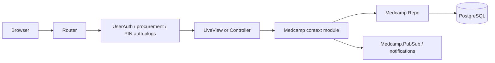

# Architecture

Medcamp is a Phoenix 1.7 application (`app: :medcamp`) using LiveView for most screens, Ecto/PostgreSQL for persistence, Bandit for HTTP, Swoosh for mail, and the Phoenix esbuild plus Tailwind asset pipeline.

## Layers

- Web layer: `lib/medcamp_web/router.ex` defines browser/API pipelines, role-specific plugs, LiveView sessions, controllers, and public routes. LiveViews live in `lib/medcamp_web/live`, controllers in `lib/medcamp_web/controllers`, and reusable UI in `lib/medcamp_web/components`.
- Business/context layer: `lib/medcamp/*.ex` files expose context functions such as `Accounts.register_user/1`, `Patients.get_available_gsrn/0`, `PatientVisits.create_patient_visit/1`, and `Procurement.Rfqs.create/2`.
- Data layer: Ecto schemas live under `lib/medcamp/<domain>/`; `Medcamp.Repo` connects to PostgreSQL. Migrations in `priv/repo/migrations` define the tables and relationships.
- Integrations: M-Pesa/payment config is under `config/config.exs` and `Medcamp.Mpesas`; email delivery is handled by `Medcamp.Sendgrid`, `Medcamp.Accounts.UserNotifier`, and `Medcamp.Mailer`; GTIN/GS1 helpers live in `Medcamp.GTIN`, `Medcamp.CreateGtin`, `Medcamp.VerifyGtin`, and related modules.

## Request Flow

## Directory Map

- `lib/medcamp`: OTP application, Repo, context modules, schemas, background helpers, and integrations.
- `lib/medcamp/accounts`: user schema, tokens, notifier, roles, passwords, and session token helpers.
- `lib/medcamp/procurement`: RFQs, quotes, proformas, purchase orders, invoices, shipment advice, GRNs, notifications, and procurement references.
- `lib/medcamp/mch`: mother and child health schemas for mothers, pregnancies, ANC, delivery, PNC, growth, immunization, and supplements.
- `lib/medcamp_web/live`: LiveView screens grouped by role or workflow.
- `lib/medcamp_web/controllers`: session, export, M-Pesa/API, user, meal PIN, medical camp, and inventory controllers.
- `lib/medcamp_web/components`: shared HEEx components for dashboards, forms, clinical records, procurement, scans, public pages, and domain-specific cards.
- `priv/repo/migrations`: database history and table definitions.
- `assets`: Phoenix Tailwind/esbuild assets, `assets/js/app.js`, `assets/css/app.css`, and vendor JS.

## Tech Stack

- Phoenix `~> 1.7.19`, Phoenix LiveView `~> 1.0.0`, Phoenix HTML, LiveDashboard.
- Ecto SQL, Postgrex, Scrivener Ecto for database access and pagination.
- Tailwind `3.4.3`, esbuild, Heroicons/ex_heroicons, live_select.
- bcrypt_elixir for password hashing.
- Swoosh, Finch, Req, HTTPoison/HTTPotion for mail and HTTP integrations.
- Timex, Number, Poison/Jason, CSV, ex_gtin for date, formatting, JSON, CSV, and GS1 helpers.

## LiveView Usage

The router is LiveView-heavy. Public website pages, authenticated role portals, supplier/procurement portals, medical camp screens, forms, dashboards, scan pages, and patient record views are all LiveViews. Role-scoped `live_session` blocks mount `MedcampWeb.UserAuth` and, for stock-sensitive portals, `MedcampWeb.StockAlertsLive.assign_stock_alerts`.
