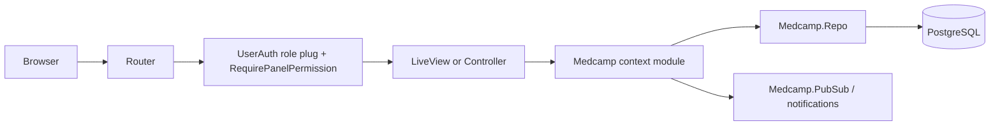

# Architecture

Medcamp is a Phoenix 1.7 application (`app: :medcamp`) using LiveView for most screens, Ecto/PostgreSQL for persistence, Bandit for HTTP, Swoosh for mail, and the Phoenix esbuild plus Tailwind asset pipeline.

## Layers

- Web layer: `lib/medcamp_web/router.ex` defines browser/API pipelines, role-specific plugs, LiveView sessions, controllers, and public routes. LiveViews live in `lib/medcamp_web/live`, controllers in `lib/medcamp_web/controllers`, and reusable UI in `lib/medcamp_web/components`.
- Business/context layer: `lib/medcamp/*.ex` files expose context functions such as `Accounts.register_user/1`, `Patients.get_available_gsrn/0`, `PatientVisits.create_patient_visit/1`, and `Procurement.Rfqs.create/2`.
- Data layer: Ecto schemas live under `lib/medcamp/<domain>/`; `Medcamp.Repo` connects to PostgreSQL. Migrations in `priv/repo/migrations` define the tables and relationships.
- Integrations: M-Pesa/payment config is under `config/config.exs` and `Medcamp.Mpesas`; email delivery is handled by `Medcamp.Sendgrid`, `Medcamp.Accounts.UserNotifier`, and `Medcamp.Mailer`; GTIN/GS1 helpers live in `Medcamp.GTIN`, `Medcamp.CreateGtin`, `Medcamp.VerifyGtin`, and related modules.

## Request Flow

## Directory Map

- `lib/medcamp`: OTP application, Repo, context modules, schemas, background helpers, and integrations.
- `lib/medcamp/accounts`: user schema, tokens, notifier, roles, passwords, and session token helpers.
- `lib/medcamp/authorization`: per-panel permissions, role defaults, user overrides, and `PanelSync`.
- `lib/medcamp/gtin`, `lib/medcamp/datamatrix_parser.ex`: GS1 GTIN validation and DataMatrix parsing, used by the pharmacy scan flow.
- `lib/medcamp_web/live`: LiveView screens grouped by role or workflow.
- `lib/medcamp_web/controllers`: session, camp export, pharmacy scan API, user, medical camp PIN, patient document, and transcription controllers.
- `lib/medcamp_web/components`: shared HEEx components for dashboards, clinical records, scans, stock alerts, and the role sidebars.
- `lib/medcamp_web/sidebar_catalog.ex`: the single source of truth for what each role can see — drives both the sidebar and route enforcement.
- `priv/repo/migrations`: one baseline migration creating the whole camp schema, plus the panel-permission seed.
- `assets`: Phoenix Tailwind/esbuild assets, `assets/js/app.js`, `assets/css/app.css`, and vendor JS.

## Tech Stack

- Phoenix `~> 1.7.19`, Phoenix LiveView `~> 1.0.0`, Phoenix HTML, LiveDashboard.
- Ecto SQL, Postgrex, Scrivener Ecto for database access and pagination.
- Tailwind `3.4.3`, esbuild, Heroicons/ex_heroicons.
- bcrypt_elixir for password hashing.
- Swoosh, Finch, Req for mail and HTTP integrations.
- Timex, Number, Jason, ex_gtin for date, formatting, JSON, and GS1 helpers.

## LiveView Usage

The router is LiveView-heavy: the five role portals, the medical camp screens, dashboards, scan pages and patient record views are all LiveViews. Role-scoped `live_session` blocks mount `MedcampWeb.UserAuth` and `MedcampWeb.Plugs.RequirePanelPermission`, plus `MedcampWeb.StockAlertsLive.assign_stock_alerts` for the admin and pharmacist sessions.

## Verification Without A Compile

Three scripts under `scripts/` check the tree without needing the dependency
graph, which is useful for large mechanical refactors:

- `elixir scripts/check_syntax.exs` — parses every `.ex`/`.exs`.
- `python3 scripts/find_dangling_refs.py` — flags `Medcamp*` references that
  no longer resolve to a module in the tree (`--by-file` groups by file).
- `python3 scripts/check_heex.py` — tag-balance check for `~H` templates.

None of them replace `mix compile` and `mix test`; they narrow down where to
look first.
