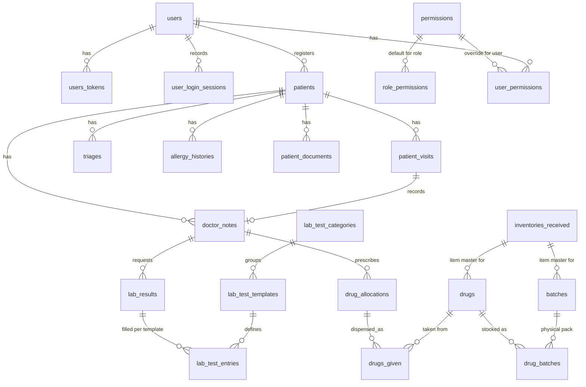

# Data Model

PostgreSQL via Ecto. The whole schema is created by a single baseline
migration, `priv/repo/migrations/*_create_camp_baseline.exs` — a camp starts
from an empty database, so there is no migration history to replay.

## The visit is the spine

`patient_visits.status` drives every role queue:

`triage_pending → triaged → with_doctor → lab_pending | pharmacy_pending → completed`

A visit is created together with its patient
(`Medcamp.Patients.register_for_camp/2`) and never by hand. The index on
`(date, status)` is what every queue read goes through.

There are no payment columns anywhere in the camp schema — no wallets,
charges, M-Pesa transactions, invoices or costings.

## Pharmacy identity

`inventories_received` is the **item master**: one row per product, keyed by
GTIN, carrying brand/generic name, strength, category and UoM. Its legacy
name is a holdover — it is a catalogue, not a goods receipt, and the camp has
no procurement chain. It survives the trim because `inventory_received_id` is
the identity a prescription and a dispense are recorded against, including
inside the JSONB `drug_allocations.drugs_assigned` payload.

A `batch` is a physical pack as printed: GTIN, batch/lot, expiry, serial. A
`drug_batch` links a batch to a drug and carries `is_confirmed`, set only by
scanning the pack's GS1 DataMatrix. Only confirmed batches can be dispensed
from. `(gtin, batch)` is indexed because that pair is what every scan resolves.

## Embedded data

Three JSONB columns carry structured payloads rather than child tables:

| Column | Shape |
| --- | --- |
| `drug_allocations.drugs_assigned` | one entry per prescribed drug: names, quantity, frequency, duration, route, `inventory_received_id` |
| `drugs_given.batch_allocations` | which batches a dispensed quantity came from, and whether each was scan-verified |
| `lab_results.tests` | the tests requested on an order |

## Audit

`Medcamp.Repo.audited_insert/update/delete` writes an `audit_logs` row with
the before/after state and the changed fields. `user_login_sessions` records
login and logout times.
