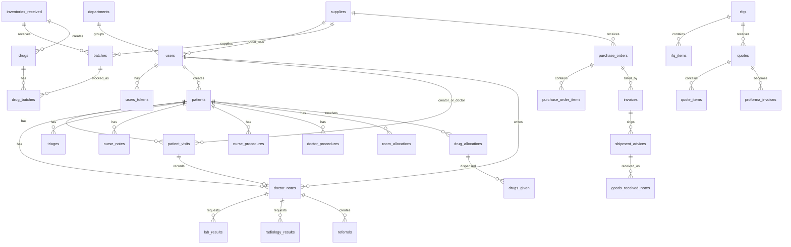

# Data Model

The database is PostgreSQL via Ecto migrations in `priv/repo/migrations`. The schema surface is large; this document focuses on the main relationships that drive the app.

## Core Tables

- Identity and access: `users`, `users_tokens`, `user_login_sessions`, `departments`, `audit_logs`.
- Patient care: `patients`, `patient_visits`, `doctor_notes`, `nurse_notes`, `triages`, `room_allocations`, `admission_requests`, `admission_request_line_items`, inpatient notes (`admission_notes`, `continuation_notes`, `treatment_sheets`, `vital_records`, `discharge_summaries`), `cadex_notes`.
- Diagnostics: `lab_tests`, `lab_results`, templated lab tables (`lab_test_categories`, `lab_test_templates`, `lab_test_entries`), `radiology_tests`, `radiology_results`, `quality_assurance_charts`.
- Pharmacy and stock: `inventories_received`, `batches`, `drugs`, `drug_batches`, `drug_allocations`, `drugs_given`, `pharmacy_logs`, `dangerous_drug_registers`, `inventories_issued`, `general_inventory_items`, `general_inventory_transactions`, `stock_takes`, `stock_take_entries`.
- Billing/payments: `patient_visits`, `lab_results`, `doctor_procedures`, `nurse_procedures`, `drug_allocations`, `room_allocations`, `admission_requests`, `patient_charges`, `patient_charge_batches`, `wallet_deposits`, `wallet_withdrawals`, `mpesas`.
- Procurement/suppliers: `suppliers`, supplier legacy docs/order tables, `supplier_directors`, `rfqs`, `rfq_items`, `rfq_invitations`, `quotes`, `quote_items`, `proforma_invoices`, `proforma_invoice_items`, `purchase_orders`, `purchase_order_items`, `invoices`, `invoice_items`, `shipment_advices`, `shipment_items`, `goods_received_notes`, `grn_items`, `procurement_notifications`.
- MCH: `mch_mothers`, `mch_pregnancies`, `mch_children`, ANC, delivery, PNC, child monitoring, immunization, vitamin A, deworming, milestones, and eye assessment tables.
- Operations/content: `appointments`, `referrals`, `patient_form_records`, `sops`, `requisitions`, `todos`, `daily_activities`, `staff_meal_supplies`, `shift_handovers`, `visitor_book_entries`, `blog_posts`, `blog_sections`, `patient_feedbacks`, `community_health_survey_responses`.

## Relationship Notes

- `patients.creator_id` points to `users`; most clinical tables point back to `patients` and the staff user who created or owns the record.
- `patient_visits` can have one `doctor_note`; doctor notes can request labs, radiology, referrals, prescriptions, procedures, and admission workflows.
- `lab_results` and `radiology_results` keep both requester and performer links (`doctor_id`, `lab_technician_id` or `radiologist_id`) and payment fields.
- Inventory starts at `inventories_received`, becomes one or more `batches`, then feeds `drugs` and `drug_batches`. Dispensing starts at `drug_allocations` and records actual dispensed items in `drugs_given`.
- Procurement uses its own order-flow tables but links back to `suppliers`, `users`, and `inventories_received` for cataloged items.
- Supplier users are normal `users` with role `supplier` and `supplier_id` linking them to the supplier record.

TODO: Add a generated ERD from the migrations once the table count stabilizes; this file currently documents the primary relationships rather than every column.
